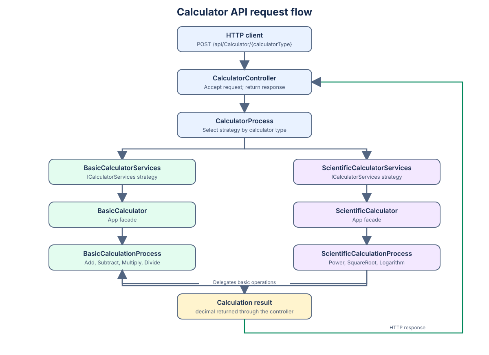

# SOLID Core Refresher

A small ASP.NET Core Web API project for practicing SOLID-oriented design. The API accepts a calculator type and an operation, selects a calculator implementation through dependency injection, and returns the calculation result.

## Requirements

- .NET 10 SDK

## Run the API

From the repository root:

```sh
dotnet run --project APICalculator/APICalculator.csproj
```

In Development, Swagger UI is available at the application root. The API endpoint is:

```text
POST /api/Calculator/{calculatorType}
```

Use `BasicCalculator` or `ScientificCalculator` for `calculatorType`. For example:

```sh
curl -X POST http://localhost:5291/api/Calculator/BasicCalculator \
  -H "Content-Type: application/json" \
  -d '{"sampleValue1":12,"sampleValue2":4,"operationType":"Add"}'
```

The request body has this shape:

```json
{
  "sampleValue1": 12,
  "sampleValue2": 4,
  "operationType": "Add"
}
```

Basic operations are `Add`, `Subtract`, `Multiply`, and `Divide`. Scientific operations are `Power`, `SquareRoot`, and `Logarithm`; other operation names passed to the scientific calculator are delegated to the basic calculation process.

## Project structure

```text
APICalculator/
├── App/
│   ├── Implementation/       # Basic and scientific calculator facades
│   └── Interfaces/           # Calculator capability contracts
├── Controllers/              # HTTP endpoint and request/response handling
├── DTOs/                     # Calculation request and result records
├── Process/
│   ├── Implementation/       # Calculator selection and calculation logic
│   └── Interfaces/           # Selection and calculation process contracts
├── Services/
│   ├── Implementation/       # Calculator-type strategies/adapters
│   └── Interfaces/           # Calculator strategy contract
├── Program.cs                # Dependency injection and HTTP pipeline setup
└── APICalculator.csproj      # Target framework and package references
```

## SOLID principles in the design

| Principle | How the project demonstrates it |
| --- | --- |
| **Single Responsibility** | HTTP handling, calculator selection, service adaptation, and calculation work are separated across controllers, process, service, and app classes. |
| **Open/Closed** | Calculator types are selected from registered `ICalculatorServices` strategies. A new strategy can be added without putting calculator-type selection branches into the controller. |
| **Liskov Substitution** | Calculator strategies are consumed through `ICalculatorServices`, allowing the basic and scientific implementations to be selected through the same contract. |
| **Interface Segregation** | Basic and scientific calculation capabilities have separate interfaces, rather than requiring each calculator implementation to expose both capabilities. |
| **Dependency Inversion** | Controllers and implementation layers receive interfaces through constructor injection; concrete implementations are wired in `Program.cs`. |

## Request flow


